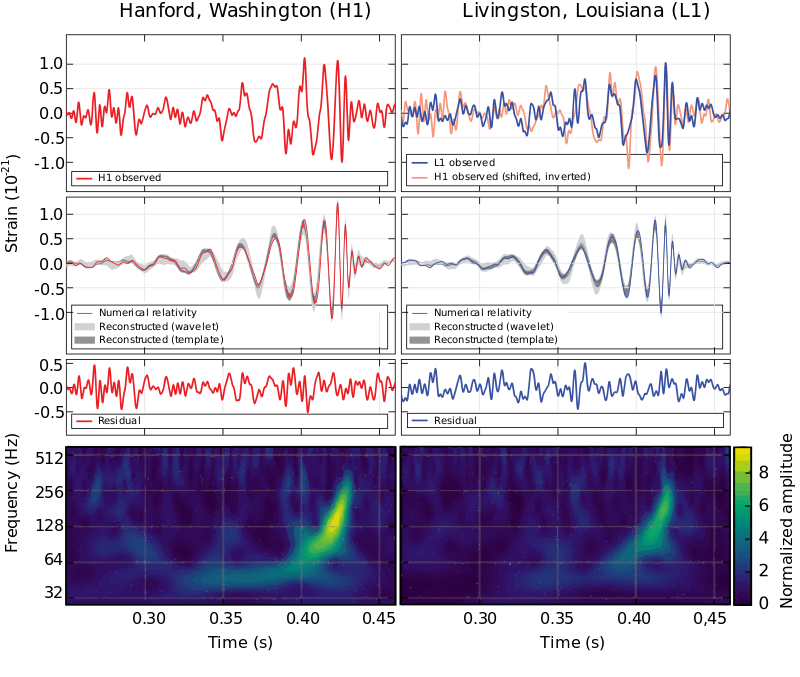

# Detecting-Narrow-Gravitational-Wave-Signals-from-Binary-Black-Hole-Collisions
### Find gravitational wave signals from binary black hole collisions.

### Description 
GW signals have led researchers to observe a new population of massive, stellar-origin black holes, to unlock the mysteries of neutron star mergers, and to measure the expansion of the Universe. These signals are unimaginably tiny ripples in the fabric of space-time and even though the global network of GW detectors are some of the most sensitive instruments on the planet, the signals are buried in detector noise. Analysis of GW data and the detection of these signals is a crucial mission for the growing global network of increasingly sensitive GW detectors. These challenges in data analysis and noise characterization could be solved with the help of data science.

As with the multi-disciplined approach to the discovery of GWs, additional expertise will be needed to further GW research. In particular, social and natural sciences have taken an interest in machine learning, deep learning, classification problems, data mining, and visualization to develop new techniques and algorithms to efficiently handle complex and massive data sets. The increase in computing power and the development of innovative techniques for the rapid analysis of data will be vital to the exciting new field of GW Astronomy. Potential outcomes may include increased sensitivity to GW signals, application to control and feedback systems for next-generation detectors, noise removal, data conditioning tools, and signal characterization.

G2Net is a network of Gravitational Wave, Geophysics and Machine Learning. Via an Action from COST (European Cooperation in Science and Technology), a funding agency for research and innovation networks, G2Net aims to create a broad network of scientists. From four different areas of expertise, namely GW physics, Geophysics, Computing Science and Robotics, these scientists have agreed on a common goal of tackling challenges in data analysis and noise characterization for GW detectors.

> *The series of images above were taken from the 2015 paper announcing the discovery of gravitational waves from a pair of merging black holes.*

### Approach
I have provided 2 solutions here:
- Using Vision Transformer (AUC = 0.86)
- Using EfficientNet (AUC = 0.85)
